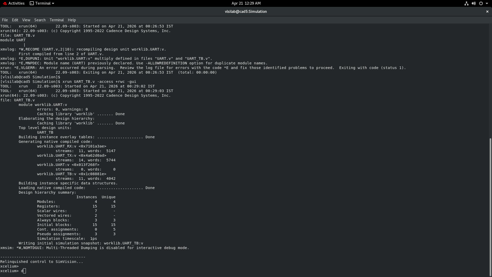
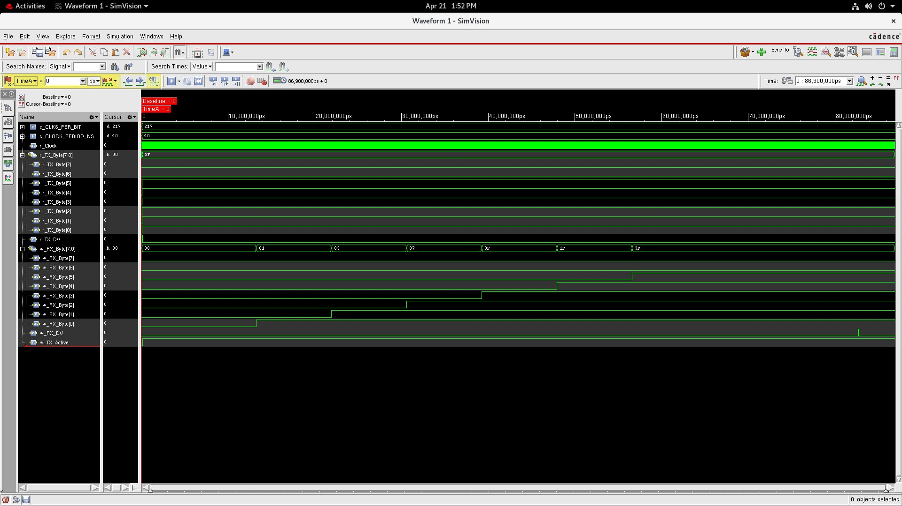
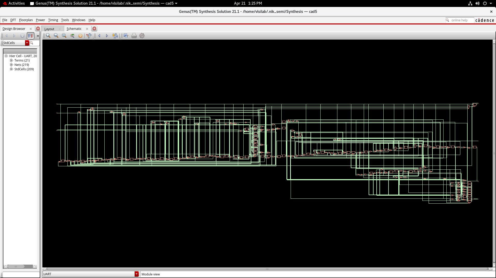
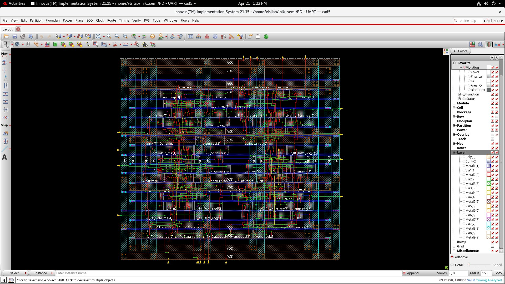
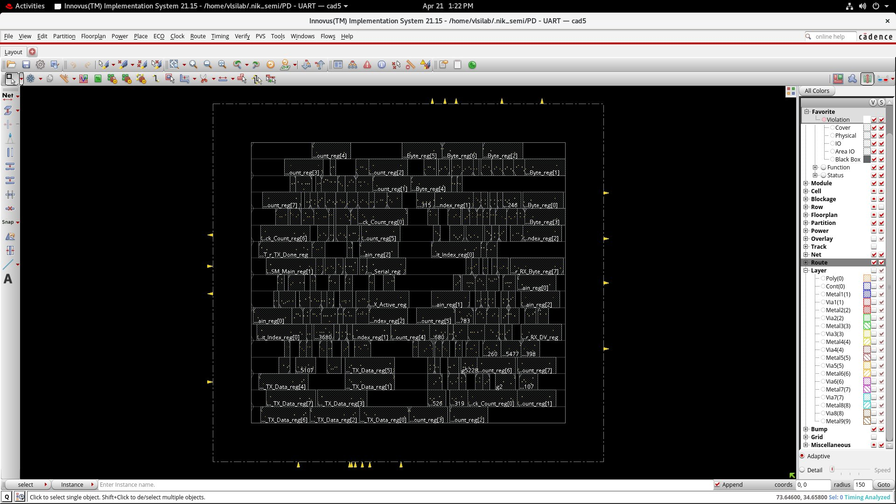
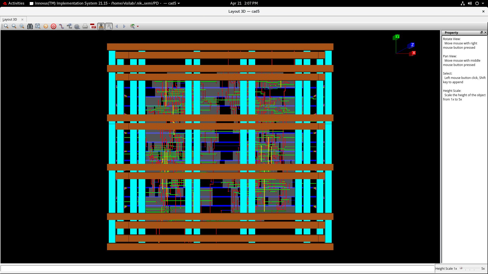
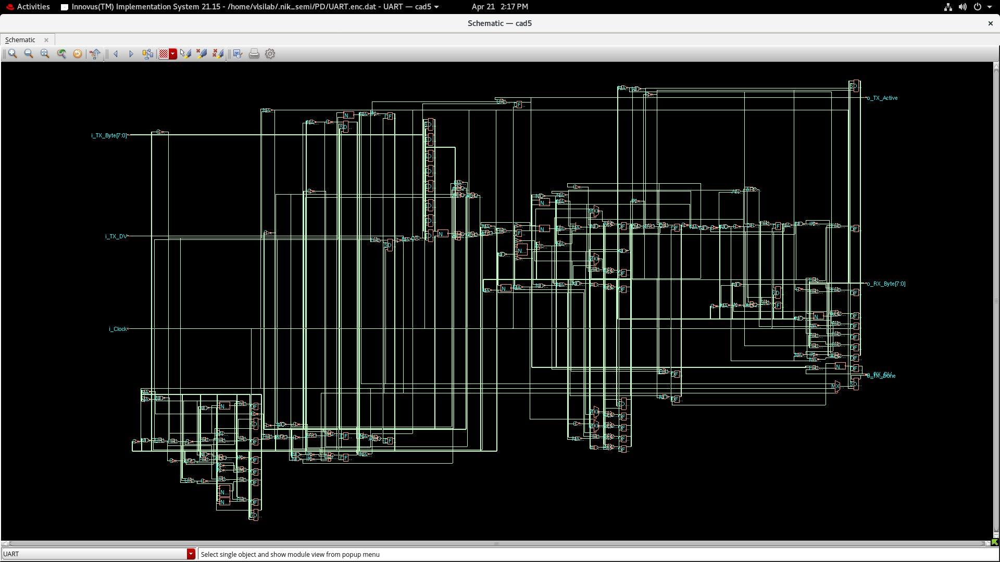
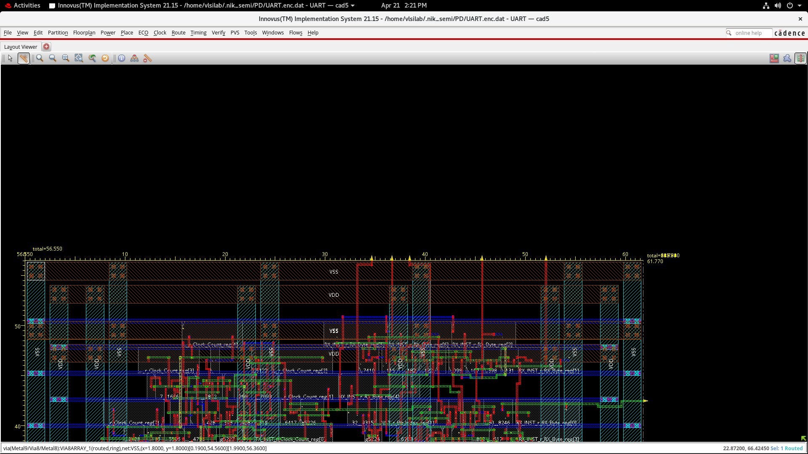

# UART ASIC — Full RTL-to-GDSII Implementation

> **A complete end-to-end ASIC design project**: parameterised 8N1 UART core taken from behavioural Verilog through functional simulation, logic synthesis, formal equivalence checking, and fully-routed physical implementation using the industry-standard Cadence EDA toolchain.

---

## Table of Contents

1. [Project Overview](#1-project-overview)
2. [Repository Structure](#2-repository-structure)
3. [Design Specifications](#3-design-specifications)
4. [RTL Architecture](#4-rtl-architecture)
5. [Functional Simulation — Cadence Xcelium & SimVision](#5-functional-simulation--cadence-xcelium--simvision)
6. [Logic Synthesis — Cadence Genus](#6-logic-synthesis--cadence-genus)
7. [Formal Equivalence Checking — Cadence Conformal LEC](#7-formal-equivalence-checking--cadence-conformal-lec)
8. [Physical Design — Cadence Innovus](#8-physical-design--cadence-innovus)
9. [Results Summary](#9-results-summary)
10. [Tool Flow](#10-tool-flow)
11. [How to Reproduce](#11-how-to-reproduce)

---

## 1. Project Overview

This project implements a **parameterised Universal Asynchronous Receiver-Transmitter (UART)** core and takes it through every stage of a modern digital ASIC implementation flow:

| Stage | Tool | Status |
|---|---|---|
| Behavioural RTL | Verilog (hand-written) | ✅ Complete |
| Functional Simulation | Cadence Xcelium + SimVision | ✅ Verified |
| Logic Synthesis | Cadence Genus 21.1 | ✅ Timing Clean |
| Formal Equivalence | Cadence Conformal LEC | ✅ 100% Equivalent |
| Place & Route | Cadence Innovus 21.15 | ✅ DRC/LVS Clean |

The design targets a **90 nm standard cell library** at a **25 MHz system clock**, achieving a baud rate of **115,200 bps** with a critical path slack of **+38.1 ns** and a total power consumption of only **38.8 µW**.

---

## 2. Repository Structure

```
uart-asic-design/
├── UART.v              # Top-level wrapper with TX↔RX loopback mux
├── UART_TX.v           # Transmitter FSM
├── UART_RX.v           # Receiver FSM with mid-bit sampling
├── UART_TB.v           # Self-checking testbench (sends 0x3F)
├── docs/
│   ├── uart_area.rep   # Genus area report
│   ├── uart_gate.rep   # Genus gate-level cell report
│   ├── uart_power.rep  # Genus power report
│   ├── uart_timing.rep # Genus timing/STA report
│   └── images/
│       ├── 01_xcelium_simulation.png
│       ├── 02_innovus_layout_routed.png
│       ├── 03_innovus_layout_clean.png
│       ├── 04_genus_schematic.png
│       ├── 05_simvision_waveform.png
│       ├── 06_innovus_3d_layout.png
│       ├── 07_innovus_schematic_pnr.png
│       └── 08_innovus_layout_viewer.png
└── README.md
```

---

## 3. Design Specifications

| Parameter | Value |
|---|---|
| Protocol | **8N1** (1 start, 8 data LSB-first, 1 stop, no parity) |
| System Clock | **25 MHz** (40 ns period) |
| Target Baud Rate | **115,200 bps** |
| `CLKS_PER_BIT` | **217** (= 25,000,000 / 115,200, rounded) |
| Technology Node | **90 nm** standard cell library (slow corner) |
| Data Width | **8 bits** |
| Test Payload | `0x3F` (`00111111` binary) |

### Protocol Frame Structure

```
IDLE  START   D0    D1    D2    D3    D4    D5    D6    D7   STOP   IDLE
 ¯¯¯|____|¯¯¯¯|____|¯¯¯¯|¯¯¯¯|¯¯¯¯|¯¯¯¯|¯¯¯¯|¯¯¯¯|¯¯¯¯|¯¯¯¯|¯¯¯¯|¯¯¯¯
       ↑                 LSB first                          MSB   ↑
    Logic 0                                                   Logic 1
```

Each bit cell = **217 clock cycles × 40 ns = 8.68 µs → 115,207 bps actual**

---

## 4. RTL Architecture

### Module Hierarchy

```
UART (top)
├── UART_TX   — Transmitter
└── UART_RX   — Receiver
```

The top-level module instantiates both TX and RX and implements an **internal loopback multiplexer**:

```verilog
// TX serial output connects directly to RX input during active transmission
assign w_UART_Line = (o_TX_Active) ? w_TX_Serial : 1'b1;
```

This allows end-to-end loopback verification without any external hardware.

### UART_TX — Transmitter State Machine

| State | Action |
|---|---|
| `IDLE` | Line held HIGH; waits for `i_TX_DV` assertion |
| `TX_START_BIT` | Drives line LOW for exactly `CLKS_PER_BIT` cycles |
| `TX_DATA_BITS` | Serially shifts out 8 data bits LSB-first |
| `TX_STOP_BIT` | Drives line HIGH for `CLKS_PER_BIT` cycles |
| `CLEANUP` | One-cycle flag pulse on `o_TX_Done`; returns to IDLE |

### UART_RX — Receiver State Machine

| State | Action |
|---|---|
| `IDLE` | Monitors serial line for falling edge (start condition) |
| `RX_START_BIT` | Samples at **`CLKS_PER_BIT/2`** (mid-bit); validates start bit is still LOW — false-start protection |
| `RX_DATA_BITS` | Samples each bit at mid-point; accumulates into shift register |
| `RX_STOP_BIT` | Validates stop bit = HIGH; assembles full byte |
| `CLEANUP` | Asserts `o_RX_DV` for one cycle; presents valid byte on `o_RX_Byte` |

> **Mid-bit sampling** is the key noise-immunity technique: sampling at `CLKS_PER_BIT/2 = 108` cycles into each bit window ensures maximum setup/hold margin away from bit edges regardless of transmitter-side jitter.

### Design Complexity (from Xcelium elaboration)

| Metric | Value |
|---|---|
| Unique modules | **4** |
| Registers | **15** |
| D-Flip-Flops (post-synthesis) | **48** |
| Always blocks | 3 |
| Continuous assignments | 5 |
| Simulation timescale | 1 ps resolution |

---

## 5. Functional Simulation — Cadence Xcelium & SimVision

### Testbench Strategy

The testbench (`UART_TB.v`) drives a single-byte transaction and relies on the internal loopback to verify full TX→RX integrity:

```verilog
// Send 0x3F = 0b00111111 (LSB first on serial line)
r_TX_DV   <= 1'b1;
r_TX_Byte <= 8'h3F;
@(posedge r_Clock);
r_TX_DV <= 1'b0;

// Wait for full 10-bit frame to complete
#(c_CLKS_PER_BIT * 10 * c_CLOCK_PERIOD_NS);
```

**Simulation window:** `86,900,000 ps` — sufficient to capture the full frame at 217 clocks/bit × 10 bits × 40 ns.

### Debugging & Fixes Applied

During development, two class of EDA tool issues were encountered and resolved:

1. **Timescale conflict:** Initial elaboration failed with `*E,DUPUNI` (multiply-defined unit) because `UART_TB.v` used `` `include "UART.v" `` while also compiling it separately. Resolved by invoking `xrun UART_TB.v -access +rwc -gui` with a single top-level entry point, allowing Xcelium to handle the full hierarchy automatically.

2. **Stale database corruption:** A prior partial compile left an invalid `INCA_libs/` snapshot. Cleared with `rm -rf INCA_libs/` before re-running; Xcelium rebuilt cleanly from scratch.

### Simulation Results

| Signal | Observed Value | Expected | Pass? |
|---|---|---|---|
| `r_TX_Byte` | `0x3F` | `0x3F` | ✅ |
| `w_RX_Byte` (final) | `0x3F` | `0x3F` | ✅ |
| `w_RX_DV` | Asserts at frame end | One-cycle pulse | ✅ |
| `w_TX_Active` | HIGH during transmission | Entire frame duration | ✅ |
| Byte accumulation | `0x01→0x03→0x07→0x0F→0x1F→0x3F` | LSB-first shift | ✅ |

The SimVision waveform confirmed correct LSB-first serial transmission and proper mid-bit receiver accumulation, with `w_RX_Byte` building up through `0x01 → 0x03 → 0x07 → 0x0F → 0x1F → 0x3F` as each successive `1` bit was received.

**Simulation Screenshot — Cadence Xcelium elaboration (zero errors, zero warnings):**



**SimVision Waveform — full loopback TX→RX verification:**



---

## 6. Logic Synthesis — Cadence Genus

### SDC Constraints Applied

```tcl
# 25 MHz clock — 40 ns period
create_clock -name i_Clock -period 40 [get_ports i_Clock]

# I/O transition and delay constraints
set_input_transition  0.1 [all_inputs]
set_output_load       0.1 [all_outputs]
set_input_delay       0.8 -clock i_Clock [all_inputs]
set_output_delay      0.8 -clock i_Clock [all_outputs]
```

Synthesis was run at the **slow (worst-case) PVT corner** to guarantee timing closure under the most pessimistic conditions.

### Area Results

**Total cell area: 1,530.452 µm² | 209 standard cells**

| Category | Instances | Area (µm²) | Percentage |
|---|---|---|---|
| Sequential (DFF/SDFF) | 48 | 845.457 | **55.2%** |
| Logic (combinational) | 127 | 607.791 | **39.7%** |
| Inverters | 34 | 77.204 | **5.0%** |
| **Total** | **209** | **1,530.452** | **100%** |

Key cell types instantiated: `DFFQX1/X2` (23+9), `SDFFQX1/X2` (14+2), `OAI21X1/XL`, `NAND2XL`, `NOR2XL`, `CLKINVX1`, `AO22XL`, `MXI2XL`.

### Power Results

**Total power: 38.8 µW**

| Category | Leakage (W) | Internal (W) | Switching (W) | Total (W) | Row % |
|---|---|---|---|---|---|
| Register | 5.60e-06 | 2.13e-05 | 3.36e-06 | **3.02e-05** | **77.89%** |
| Logic | 2.80e-06 | 2.76e-06 | 1.40e-06 | 6.96e-06 | 17.95% |
| Clock | 0 | 0 | 1.62e-06 | 1.62e-06 | 4.17% |
| **Total** | **8.40e-06** | **2.40e-05** | **6.38e-06** | **3.88e-05** | **100%** |

Power is dominated by register switching activity (77.9%) — expected given the 48 flip-flops toggling at 25 MHz.

### Timing Results

**Critical path: 1,690 ps | Timing slack: +38,109 ps (38.1 ns)**

```
Launch:  TX_INST_r_TX_Active_reg/CK   →  0 ps
         DFFQX2/Q                     → +694 ps    (541 ps slew)
         NOR2BX1/Y                    → +917 ps
         NAND3X1/Y                    → +990 ps
         NAND4XL/Y                    →+1132 ps
         NOR2XL/Y                     →+1472 ps
         AO22XL/Y                     →+1690 ps
Capture: RX_INST_r_Clock_Count_reg[3]/D        (setup check)

Required time:   39,990 ps  (40 ns – 10 ps uncertainty)
Arrival time:     1,881 ps
───────────────────────────────
Timing slack:   +38,109 ps  ✅  (design is massively over-constrained)
```

The large positive slack reflects that UART logic is computationally simple relative to a 25 MHz clock — the design could theoretically run at several GHz with a more aggressive technology node.

**Genus Schematic View (post-synthesis gate-level netlist):**



---

## 7. Formal Equivalence Checking — Cadence Conformal LEC

A custom Tcl script was written to formally verify that synthesis did not alter the logical function of the design:

```tcl
// Conformal LEC script
read_library   -statetable slow.lib
read_design    -golden    UART.v UART_TX.v UART_RX.v -i verilog
read_design    -revised   UART_netlist.v             -i verilog

set_mapping_method -name
map_key_points

verify
report_unmapped_points
report_non_equivalent_points
```

### LEC Results

| Check | Result |
|---|---|
| Primary Inputs mapped | **10 / 10** |
| Primary Outputs mapped | **11 / 11** |
| D-Flip-Flops mapped | **48 / 48** |
| Unmapped points | **0** |
| Non-equivalent points | **0** |
| **Overall verdict** | ✅ **100% EQUIVALENT** |

Formal equivalence checking provides a mathematical guarantee that the synthesised netlist is functionally identical to the golden RTL — no bugs were introduced by the Genus optimization passes.

---

## 8. Physical Design — Cadence Innovus

### Floorplanning

A rectangular die footprint was defined to achieve a reasonable utilisation target:

| Parameter | Value |
|---|---|
| Die width | **61.770 µm** |
| Die height | **56.550 µm** |
| Total die area | **~3,493 µm²** |
| Core cell area | **1,530.452 µm²** |
| Utilisation | **~44%** (leaving room for routing congestion relief) |

### Power Planning

Power rings were constructed on upper metal layers for low-resistance distribution:

- **VDD ring:** Metal 5 (horizontal) + Metal 6 (vertical)
- **VSS ring:** Metal 5 (horizontal) + Metal 6 (vertical)
- Standard cell rows connected via M1 power stripes to the rings

### Placement

Standard cell placement was completed with Innovus's global + detailed placement engine. The placement density heatmap confirms uniform distribution with no localised congestion hotspots.

### Clock Tree Synthesis (CTS)

CTS was run for the single clock domain (`i_Clock`) driving all **48 flip-flops**:

- Clock buffer insertion performed on `CLKINVX1` cells (24 instances)
- Clock skew minimised across the full flip-flop network
- No hold violations introduced post-CTS

### Routing

Full detailed routing completed across a **9-metal-layer stack** (`Metal1` through `Metal9`, `Via1`–`Via8`):

- Signal routing: Metal 1–4 preferred for local connections
- Power routing: Metal 5–6 for VDD/VSS rings and stripes
- Long-range signals: Metal 7–9 for global connectivity

### Physical Verification (Cadence PVS)

| Check | Result |
|---|---|
| Design Rule Check (DRC) | ✅ **0 violations** |
| Layout vs. Schematic (LVS) | ✅ **0 violations** |

**Innovus Layout — fully routed (with power rings and metal fill):**



**Innovus Layout — clean cell view (routing hidden):**



**Innovus 3D Layout View — metal layer stack visible:**



**Post-PnR Schematic (Innovus netlist view):**



**Layout Viewer — zoomed detail with VSS via array visible:**



---

## 9. Results Summary

| Metric | Value |
|---|---|
| **Protocol** | 8N1 UART |
| **Technology** | 90 nm standard cell (slow corner) |
| **Clock** | 25 MHz |
| **Baud Rate** | 115,200 bps (217 clks/bit) |
| **Standard Cells** | **209** (48 seq / 127 logic / 34 inv) |
| **Cell Area** | **1,530.452 µm²** |
| **Die Area** | **3,493 µm²** (~44% utilisation) |
| **Critical Path** | **1,690 ps** |
| **Timing Slack** | **+38,109 ps** ✅ |
| **Total Power** | **38.8 µW** |
| **DRC Violations** | **0** |
| **LVS Violations** | **0** |
| **LEC Equivalence** | **100%** (48/48 DFFs matched) |

---

## 10. Tool Flow

```
┌─────────────────────────────────────────────────────────────────┐
│                      UART ASIC Design Flow                      │
└─────────────────────────────────────────────────────────────────┘

  [Verilog RTL]
  UART.v / UART_TX.v / UART_RX.v
        │
        ▼
  ┌─────────────────────────┐
  │  Cadence Xcelium        │  ← Functional simulation
  │  + SimVision            │    Testbench: 0x3F loopback
  └────────────┬────────────┘    ✅ TX→RX verified
               │
        ▼
  ┌─────────────────────────┐
  │  Cadence Genus 21.1     │  ← Logic synthesis
  │  (90nm, slow corner)    │    SDC: 40ns clock, 0.8ns I/O delay
  └────────────┬────────────┘    ✅ 209 cells, 1530µm², 38.8µW
               │
        ▼
  ┌─────────────────────────┐
  │  Cadence Conformal LEC  │  ← Formal equivalence check
  │                         │    RTL golden vs. gate netlist
  └────────────┬────────────┘    ✅ 100% equivalent, 0 non-EQ points
               │
        ▼
  ┌─────────────────────────┐
  │  Cadence Innovus 21.15  │  ← Place & Route
  │                         │    Floorplan → Power → Place → CTS → Route
  └────────────┬────────────┘    ✅ DRC/LVS clean, 9-metal stack
               │
        ▼
  [GDSII / Layout Database]
  61.77µm × 56.55µm die, fully routed
```

---

## 11. How to Reproduce

### Prerequisites

- Cadence Xcelium (≥ 22.09) for simulation
- Cadence Genus (≥ 21.1) for synthesis
- Cadence Conformal LEC for equivalence checking
- Cadence Innovus (≥ 21.15) for place & route
- 90 nm standard cell library (`slow.lib` + LEF)

### Step 1 — Functional Simulation

```bash
# Compile and simulate with GUI waveform viewer
xrun UART_TB.v -access +rwc -gui

# In Xcelium prompt:
# > run
# Then open SimVision to inspect waveforms
```

### Step 2 — Logic Synthesis (Genus)

```tcl
# In Genus Tcl shell
read_libs  slow.lib
read_hdl   UART.v UART_TX.v UART_RX.v
elaborate  UART

# Apply SDC constraints
create_clock -name i_Clock -period 40 [get_ports i_Clock]
set_input_transition  0.1 [all_inputs]
set_output_load       0.1 [all_outputs]
set_input_delay       0.8 -clock i_Clock [all_inputs]
set_output_delay      0.8 -clock i_Clock [all_outputs]

syn_generic
syn_map
syn_opt

# Reports
report_area   > docs/uart_area.rep
report_gates  > docs/uart_gate.rep
report_power  > docs/uart_power.rep
report_timing > docs/uart_timing.rep

write_hdl > UART_netlist.v
```

### Step 3 — Formal Equivalence (Conformal LEC)

```tcl
read_library   -statetable slow.lib
read_design    -golden  UART.v UART_TX.v UART_RX.v -i verilog
read_design    -revised UART_netlist.v             -i verilog
set_mapping_method -name
map_key_points
verify
report_unmapped_points
report_non_equivalent_points
```

### Step 4 — Place & Route (Innovus)

```tcl
# Read synthesised netlist + technology files
read_netlist  UART_netlist.v
read_lef      tech.lef cells.lef
read_mmmc     mmmc.tcl   ;# defines slow corner

init_design

# Floorplan: 61.77 x 56.55 µm
floorPlan -site CoreSite -r 1.0 0.44 2.0 2.0 2.0 2.0

# Power rings on M5/M6
addRing -nets {VDD VSS} -type core_rings \
        -layer_top M6 -layer_bottom M6 \
        -layer_left M5 -layer_right M5 \
        -width 1.0 -spacing 0.5

# Placement
place_design
optDesign -preCTS

# Clock Tree Synthesis
ccopt_design

# Routing
routeDesign
optDesign -postRoute

# Verification
verify_drc
verify_lvs
```

---

## Author

**Goluguri Nikhil Suri Reddy**
B.Tech ECE, Indian Institute of Information Technology Sri City (2023–2027)
[LinkedIn](https://www.linkedin.com/in/goluguri-nikhil-suri-reddy-470473300/) · [GitHub](https://github.com/nik127-oss)

---

*Designed and implemented entirely using the Cadence EDA toolchain: Xcelium → Genus → Conformal LEC → Innovus. All synthesis and physical design results are from actual tool reports included in this repository under `docs/`.*
